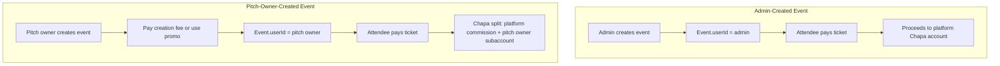
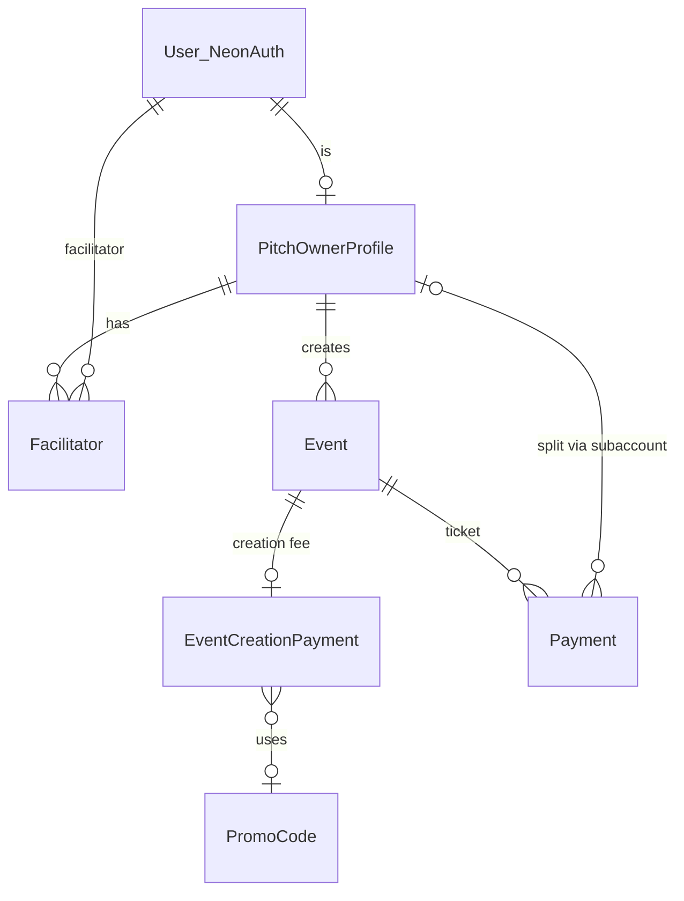

# Event Creation and Payment Model Redesign — Technical Implementation Plan

---

## 1. Product / Business Logic Breakdown

### New Platform Model

The platform shifts from **direct operator** (platform owns events and charges users) to a **marketplace/middleman** model:

- **Platform**: Provides infrastructure, payment rails, discovery, and takes a commission on pitch-owner events
- **Pitch Owners**: Third-party operators who create events, set ticket prices, and receive settlement via Chapa subaccounts
- **Facilitators**: Limited staff created by pitch owners to scan tickets only
- **Admins**: Platform operators with full oversight

### Actor Responsibilities

| Actor           | Can Do                                                                                                                                 | Cannot Do                                                                       |
| --------------- | -------------------------------------------------------------------------------------------------------------------------------------- | ------------------------------------------------------------------------------- |
| **Admin**       | Create pitch owners; manage pricing/promo codes; create events (platform-owned); manage all users; oversee events, billing, audit logs | —                                                                               |
| **Pitch Owner** | Create/edit/delete own events; manage facilitators; configure payout details; use promo codes for free event creation                  | Self-signup; access admin features; manage other pitch owners' events           |
| **Facilitator** | Scan tickets for parent pitch owner's events                                                                                           | Create events; manage billing; access admin; manage users; edit payout settings |
| **Attendee**    | Browse events; buy tickets; receive QR codes; be checked in                                                                            | Create events; scan tickets; access admin                                       |

### Event Ownership and Lifecycle



**Admin-created events**: `Event.userId` = admin user ID. Ticket payments go to platform default Chapa account. No split.

**Pitch-owner-created events**: `Event.userId` = pitch owner user ID. Ticket payments use Chapa split with pitch owner's subaccount. Platform takes commission (flat or percentage).

### Payment Settlement Distinction

| Event Creator | Ticket Payment Destination                                               |
| ------------- | ------------------------------------------------------------------------ |
| Admin         | Platform default Chapa account (100%)                                    |
| Pitch Owner   | Split: platform commission + remainder to pitch owner's Chapa subaccount |

---

## 2. Role-Based Access Control Design

### Roles (Neon Auth `role` metadata)

Extend `[lib/validations/admin.ts](lib/validations/admin.ts)` from `["admin", "user"]` to:

| Role        | Value         | Creation Path            |
| ----------- | ------------- | ------------------------ |
| Admin       | `admin`       | Pre-provisioned / manual |
| Pitch Owner | `pitch_owner` | Admin only via new API   |
| Facilitator | `facilitator` | Pitch owner only         |
| User        | `user`        | Public signup (default)  |

### Permissions Matrix

| Permission                       | Admin | Pitch Owner | Facilitator | User |
| -------------------------------- | ----- | ----------- | ----------- | ---- |
| `event:create` (platform)        | Yes   | No          | No          | No   |
| `event:create` (own)             | No    | Yes         | No          | No   |
| `event:edit` (own)               | Yes   | Yes         | No          | No   |
| `event:delete` (own)             | Yes   | Yes         | No          | No   |
| `event:scan` (own)               | Yes   | Yes         | No          | No   |
| `event:scan` (facilitator scope) | No    | No          | Yes         | No   |
| `pitch_owner:create`             | Yes   | No          | No          | No   |
| `facilitator:create`             | No    | Yes         | No          | No   |
| `payout:configure`               | No    | Yes (own)   | No          | No   |
| `promo:manage`                   | Yes   | No          | No          | No   |
| `admin:users`                    | Yes   | No          | No          | No   |
| `admin:events`                   | Yes   | No          | No          | No   |
| `ticket:buy`                     | Yes   | Yes         | Yes         | Yes  |

Admin can edit/delete any event via admin routes.

### Scoped Ownership Rules

1. **Pitch owner events**: `Event.userId = pitchOwnerUserId` AND `user.role = 'pitch_owner'`
2. **Facilitator scope**: Facilitator can scan only if `Event.userId = facilitator.pitchOwnerUserId` (via `Facilitator` link table)
3. **Admin-created pitch owners**: Only `role === 'admin'` can call `POST /api/admin/pitch-owners` (or equivalent) to create/upgrade a user to `pitch_owner`
4. **Banking data access**: Only pitch owner (own profile) and admin (audit/support) can read decrypted payout fields; facilitators never

### RBAC Implementation

- New guards: `requirePitchOwnerUser()`, `requireFacilitatorUser()`, `requireAdminOrPitchOwner()`
- Permission helper: `canManageEvent(user, event)` = admin OR (pitch_owner AND event.userId === user.id)
- Facilitator scan check: `canScanEvent(user, event)` = admin OR event owner OR (facilitator AND event.userId === user's parent pitch owner)

---

## 3. Data Model / Database Architecture

### Recommended Schema

**Pitch owner as role + profile**: Use `role = 'pitch_owner'` in Neon Auth and a `PitchOwnerProfile` table for bank/subaccount data. This keeps auth simple and avoids duplicate user concepts.

### New Models

```prisma
// Pitch owner profile: 1:1 with user (userId is pitch owner)
model PitchOwnerProfile {
  id                    String    @id @default(uuid()) @db.Uuid
  userId                String    @unique @map("user_id") @db.Uuid
  businessName          String?   @map("business_name") @db.VarChar(255)
  // Encrypted at rest (AES-256-GCM); never hashed
  accountNameEnc        String?   @map("account_name_enc") @db.Text
  accountNumberEnc      String?   @map("account_number_enc") @db.Text
  bankCodeEnc           String?   @map("bank_code_enc") @db.Text
  chapaSubaccountId     String?   @unique @map("chapa_subaccount_id") @db.VarChar(64)
  splitType             String?   @map("split_type") @db.VarChar(20)   // flat | percentage
  splitValue            Decimal?  @map("split_value") @db.Decimal(10, 4)
  payoutSetupVerifiedAt DateTime? @map("payout_setup_verified_at") @db.Timestamptz(6)
  createdAt             DateTime  @default(now()) @map("created_at")
  updatedAt             DateTime  @updatedAt @map("updated_at")

  facilitators Facilitator[]
  eventCreationPayments EventCreationPayment[]

  @@map("pitch_owner_profiles")
}

// Facilitator: links facilitator user to pitch owner
model Facilitator {
  id              String   @id @default(uuid()) @db.Uuid
  facilitatorUserId String @unique @map("facilitator_user_id") @db.Uuid
  pitchOwnerUserId String  @map("pitch_owner_user_id") @db.Uuid
  isActive        Boolean  @default(true) @map("is_active")
  createdAt       DateTime @default(now()) @map("created_at")
  updatedAt       DateTime @updatedAt @map("updated_at")

  pitchOwnerProfile PitchOwnerProfile @relation(fields: [pitchOwnerUserId], references: [userId])
  @@unique([facilitatorUserId])
  @@index([pitchOwnerUserId])
  @@map("facilitators")
}

// Event creation fee configuration (admin-managed)
model EventCreationFeeConfig {
  id          String   @id @default(uuid()) @db.Uuid
  amountEtb   Decimal  @map("amount_etb") @db.Decimal(10, 2)
  effectiveFrom DateTime @map("effective_from") @db.Timestamptz(6)
  effectiveTo   DateTime? @map("effective_to") @db.Timestamptz(6)
  createdAt   DateTime @default(now()) @map("created_at")

  @@map("event_creation_fee_configs")
}

// Promo/discount codes for event creation
model PromoCode {
  id            String   @id @default(uuid()) @db.Uuid
  code          String   @unique @db.VarChar(32)
  discountType  String   @map("discount_type") @db.VarChar(20)   // full | partial (future)
  discountValue Decimal @map("discount_value") @db.Decimal(10, 4)  // 100 for full, or amount/percentage
  pitchOwnerUserId String? @map("pitch_owner_user_id") @db.Uuid  // null = global
  maxUses       Int?     @map("max_uses")
  usedCount     Int      @default(0) @map("used_count")
  expiresAt     DateTime @map("expires_at") @db.Timestamptz(6)
  isActive      Boolean  @default(true) @map("is_active")
  createdAt     DateTime @default(now()) @map("created_at")
  updatedAt     DateTime @updatedAt @map("updated_at")

  eventCreationPayments EventCreationPayment[]

  @@index([code, isActive, expiresAt])
  @@index([pitchOwnerUserId])
  @@map("promo_codes")
}

// Payment for event creation (pitch owner charged)
model EventCreationPayment {
  id              String   @id @default(uuid()) @db.Uuid
  pitchOwnerUserId String  @map("pitch_owner_user_id") @db.Uuid
  eventId         String   @unique @map("event_id") @db.Uuid
  amountEtb       Decimal  @map("amount_etb") @db.Decimal(10, 2)
  promoCodeId     String?   @map("promo_code_id") @db.Uuid
  status          String   @db.VarChar(20)  // pending | paid | waived | failed
  providerReference String? @map("provider_reference") @db.VarChar(128)
  paidAt          DateTime? @map("paid_at") @db.Timestamptz(6)
  createdAt       DateTime @default(now()) @map("created_at")

  pitchOwnerProfile PitchOwnerProfile @relation(...)
  promoCode       PromoCode? @relation(...)
  event          Event @relation(...)

  @@map("event_creation_payments")
}
```

### Updated Models

**Event**: Add optional `eventCreationPaymentId` to link to creation fee payment. Keep `userId` as creator (admin or pitch owner).

**Payment** (attendee ticket payments): Add `chapaSubaccountId` (nullable) to record which subaccount was used for split; null = platform default.

### Entity Relationships



### Encrypted Fields

- `accountNameEnc`, `accountNumberEnc`, `bankCodeEnc`: AES-256-GCM with key from `PAYOUT_ENCRYPTION_KEY` (32-byte key, store in secrets manager)
- Use a dedicated `lib/encryption.ts` with encrypt/decrypt helpers; decrypt only in payout configuration and Chapa subaccount creation flows

### Chapa Subaccount Lifecycle State

Store in `PitchOwnerProfile`:

- `chapaSubaccountId`: Set when Chapa returns success
- `payoutSetupVerifiedAt`: Set when subaccount creation succeeds
- If bank details change: invalidate `chapaSubaccountId`, require re-creation

---

## 4. Payment and Billing Architecture

### Event Creation Charging Flow

**When**: Charge at event creation submission (before event is persisted).

**Sequence**:

1. Pitch owner submits event form with optional promo code
2. API validates promo (if provided); computes fee (config amount − discount)
3. If fee > 0: initialize Chapa checkout for creation fee → redirect → webhook/confirm → create event
4. If fee = 0 (promo waives): create event immediately, record `EventCreationPayment` with status `waived`
5. Store `EventCreationPayment` linked to `Event` and `PromoCode` (if used)

**Failed payment**: Do not create event. Return error; user can retry with same or different promo.

**Tracking**: `EventCreationPayment.status` ∈ {`pending`, `paid`, `waived`, `failed`}

### Promo Code Interaction

- **100% discount**: `discountType = 'full'`, `discountValue = 100` → fee = 0, status = `waived`
- **Partial discount** (future): Reduce fee by amount or percentage
- **Validation**: Check `expiresAt`, `maxUses` vs `usedCount`, `isActive`, `pitchOwnerUserId` (null = global)

### Attendee Ticket Payment Architecture

**Admin-created event**:

- `initializeChapaCheckout` without `subaccounts` in payload
- Proceeds to platform default Chapa account

**Pitch-owner-created event**:

- Load `PitchOwnerProfile` for `event.userId`
- Require `chapaSubaccountId` and valid payout setup
- If missing: block checkout, show "Payout setup incomplete" to pitch owner
- `initializeChapaCheckout` with `subaccounts: [{ id: chapaSubaccountId, split_type?, split_value? }]`
- Use profile `splitType`/`splitValue` or allow per-transaction override

**Webhook reconciliation**: Existing `confirmChapaPayment`; extend to record `chapaSubaccountId` on `Payment` when split was used

**Settlement tracking**: Add `Payment.chapaSubaccountId`; platform commission = amount × split_value (or flat deduction)

---

## 5. Chapa Subaccount and Split Payment System Design

### Official Chapa Documentation Reference

The following is derived from Chapa's split payment documentation.

**What is a subaccount?** A subaccount holds the external bank information for a third-party seller, vendor, or service provider with whom you want to split payments. When a split payment is made, the funds are sent to the bank account associated with the subaccount.

**Flow**: First create a subaccount, then initialize the split payment. Split payment is essential when there is shared payment between a service provider (pitch owner) and platform provider (Meda).

**ETB settlement**: Subaccounts work with ETB currency as default. If `subaccount` is in the payload, Chapa converts the transaction to ETB for settlement regardless of the original currency.

**Important notes from Chapa**:

- Knowing your vendors/sub-accounts is your responsibility; disputes or chargebacks are taken from your (platform) account and reflect on your image.
- Chapa fees are taken from you / customer.

---

### Create Subaccount API

**Endpoint**: `POST https://api.chapa.co/v1/subaccount`  
**Authorization**: Bearer token (Chapa secret key) in header

**Required parameters**:

| Parameter        | Description                                                                                               |
| ---------------- | --------------------------------------------------------------------------------------------------------- |
| `account_name`   | Vendor/merchant account name (must match bank account)                                                    |
| `bank_code`      | Bank ID — retrieve from the [get banks](https://developer.chapa.co/transfer/list-banks) endpoint          |
| `account_number` | Vendor's bank account number                                                                              |
| `business_name`  | Vendor/merchant detail for the subaccount                                                                 |
| `split_type`     | `percentage` — platform gets % of each transaction; `flat` — platform gets flat fee, subaccount gets rest |
| `split_value`    | Commission amount: e.g. `0.03` for 3%, or `25` for 25 Birr flat                                           |

**Example payload**:

```json
{
  "account_name": "Abebe Bikila",
  "bank_code": 128,
  "account_number": "0123456789",
  "split_value": 0.2,
  "split_type": "percentage"
}
```

**Response**: On success, Chapa returns the `subaccount id` needed when initiating a transaction.

---

### Initialize Split Payment

**Endpoint**: `POST https://api.chapa.co/v1/transaction/initialize` (or Direct Charge API)

Include `subaccounts` in the transaction payload. Example (form-style as per Chapa docs):

```
subaccounts[id]: "ac2e6b5b-0e76-464a-8c20-2d441fbaca6c"
```

Or JSON-style:

```json
{
  "amount": "10",
  "currency": "ETB",
  "email": "...",
  "tx_ref": "...",
  "callback_url": "...",
  "return_url": "...",
  "subaccounts": {
    "id": "ac2e6b5b-0e76-464a-8c20-2d441fbaca6c"
  }
}
```

---

### Overriding Defaults at Transaction Time

When initializing a payment, you can override the default `split_type` and `split_value` set on the subaccount by specifying them in the subaccounts item:

- **split_type**: `flat` (platform gets flat fee, subaccount gets rest) or `percentage` (platform gets % of settlement)
- **split_value**: Must match type — e.g. `0.03` for 3%, `25` for 25 Birr flat

**Example** (100 ETB paid, Chapa fees 6 ETB):

```json
"subaccounts": {
  "id": "3380b03b-1142-44b2-b6ab-9asec740fbe49",
  "split_type": "flat",
  "split_value": 25
}
```

- Subaccount gets: 69 ETB (100 - 6 - 25)
- Platform gets: 25 ETB

---

### When to Create Subaccount

**Recommendation: Eager on first payout config save**

- When pitch owner saves bank details and clicks "Verify" / "Save":
  1. Encrypt and store bank fields
  2. Call Chapa `POST /v1/subaccount` with decrypted values (account_name, bank_code, account_number, business_name, split_type, split_value)
  3. On success: store `chapaSubaccountId`, set `payoutSetupVerifiedAt`
  4. On failure: store error, do not set subaccount ID; show user-friendly message

**Bank code**: Use Chapa's get banks endpoint to populate a dropdown; pitch owner selects bank, we store the corresponding `bank_code`.

**Alternative (lazy)**: Create on first eligible ticket payment. Risk: first customer pays, subaccount creation fails → payment stuck.

### Subaccount Creation Flow

```
Pitch owner enters: account_name, bank_code, account_number, business_name
→ Encrypt → Save to PitchOwnerProfile (without subaccount ID)
→ Call Chapa POST /v1/subaccount with split_type, split_value
→ Success: save subaccount ID, payoutSetupVerifiedAt
→ Failure: log, return error; allow retry
```

### Handling Updates

- If bank details change: clear `chapaSubaccountId`, require new Chapa subaccount creation
- Chapa may not support subaccount update; create new subaccount, replace ID

### One Subaccount per Pitch Owner

Start with 1:1. Schema supports future `PayoutAccount` table if multiple payout accounts per pitch owner are needed.

### Per-Transaction Override

Chapa allows `subaccounts: [{ id, split_type, split_value }]` at init. Use profile defaults; support optional override in payment service for future commission models.

### Missing/Invalid Subaccount

- Block ticket checkout for pitch-owner events if `chapaSubaccountId` is null
- Show banner to pitch owner: "Complete payout setup to accept ticket payments"

### Webhook Reconciliation

- Existing webhook verifies `tx_ref`, calls `confirmChapaPayment`
- Ensure `confirmChapaPayment` receives event context to know if split was used; persist `chapaSubaccountId` on `Payment` from event's pitch owner profile

---

## 6. Discount Code System Design

### Model (see Section 3)

- `code`: Uppercase, alphanumeric, 6–16 chars
- `discountType`: `full` | `partial` (future)
- `discountValue`: 100 for full; or amount/percentage for partial
- `pitchOwnerUserId`: null = global; set = pitch-owner-specific
- `maxUses`, `usedCount`, `expiresAt`, `isActive`

### Validation at Event Creation

1. Normalize code (trim, uppercase)
2. Find active promo: `isActive AND expiresAt > now AND (maxUses IS NULL OR usedCount < maxUses)`
3. Scope: global OR `pitchOwnerUserId = current user`
4. Apply discount; increment `usedCount` on success

### Audit Trail

- `PromoCode.usedCount`; optionally `PromoCodeUsage` table (codeId, eventId, pitchOwnerUserId, usedAt) for detailed audit

### Abuse Prevention

- Rate limit promo validation
- Log failed attempts
- Admin can revoke (`isActive = false`)

### Scope

Promo codes apply **only to event creation fees** in v1. Ticket discounts are a future extension.

---

## 7. Event Ownership and Authorization Flows

| Action                  | Who          | Rule                                            |
| ----------------------- | ------------ | ----------------------------------------------- |
| Create event (platform) | Admin        | `role === 'admin'`                              |
| Create event (own)      | Pitch owner  | `role === 'pitch_owner'`                        |
| Edit event              | Admin        | Any event via admin API                         |
| Edit event              | Pitch owner  | `event.userId === user.id`                      |
| Delete event            | Same as edit |                                                 |
| View event              | All          | Public read                                     |
| Scan ticket             | Admin        | Any event                                       |
| Scan ticket             | Pitch owner  | `event.userId === user.id`                      |
| Scan ticket             | Facilitator  | `event.userId === facilitator.pitchOwnerUserId` |
| Create facilitator      | Pitch owner  | `user.id` is pitch owner                        |
| Disable facilitator     | Pitch owner  | `facilitator.pitchOwnerUserId === user.id`      |
| Edit payout             | Pitch owner  | Own profile only                                |
| View financial history  | Pitch owner  | Own events only                                 |
| View financial history  | Admin        | All                                             |

### API Authorization

- `POST /api/events/create`: Require admin OR pitch_owner; if pitch_owner, apply fee/promo flow
- `PATCH /api/events/[id]` (owner): New route for pitch owner; check `event.userId === user.id`
- `POST /api/tickets/verify/[token]`: Extend `canScan` to include facilitator with parent scope
- `GET/PATCH /api/profile/payout`: Pitch owner only; decrypt only in server

---

## 8. Ticket Scanning System Design

### Current State

- `[services/ticketVerification.ts](services/ticketVerification.ts)`: `canScan = isAdmin || isEventOwner`
- `[app/api/tickets/verify/[token]/route.ts](app/api/tickets/verify/[token]/route.ts)`: POST records scan when `canScan`

### Facilitator Extension

Add `isFacilitatorForEvent`:

- Load `Facilitator` where `facilitatorUserId = user.id` and `isActive = true`
- Get `pitchOwnerUserId`
- `canScan = isAdmin || isEventOwner || (isFacilitator && event.userId === pitchOwnerUserId)`

### QR/Ticket Validation

- Existing: `verifyToken(token)` → `attendeeId`; fetch attendee + event
- Validate `expectedEventId` matches
- Check scanner permission as above

### Duplicate Scan Prevention

- `TicketScan.attendeeId` UNIQUE; `ON CONFLICT DO NOTHING` in `recordTicketScan`
- Return `alreadyScanned: true` with `previousScan` for re-scans

### Scan Logging

- `TicketScan`: `scanId`, `attendeeId`, `eventId`, `scannedByUserId`, `scannedAt`
- Add index on `(eventId, scannedAt)` for history queries

### Offline Considerations

- Scanning requires API call; no offline mode in v1
- Consider future: queue scans, sync when online

### Facilitator UI

- Facilitator lands on `/facilitator/scan` or `/events/[id]/scan` (if event in scope)
- List only events belonging to parent pitch owner
- Same QRScanner component; backend enforces scope

### Security

- Rate limit scan endpoint
- Validate event belongs to facilitator's pitch owner
- Prevent ticket reuse: one scan per attendee (DB constraint)

---

## 9. Backend Architecture

### API Route Structure

```
/api/admin/
  pitch-owners/          POST (create), GET (list)
  pitch-owners/[id]/     GET, PATCH
  promo-codes/           CRUD
  event-creation-fee/    GET, PATCH (config)
  ...

/api/events/
  create/                POST (admin or pitch_owner; fee flow for pitch_owner)
  [id]/
    edit/                PATCH (owner or admin)
    ...

/api/profile/
  payout/                GET, PATCH (pitch owner; encrypted read/write)
  facilitators/         CRUD (pitch owner)

/api/facilitator/
  events/                GET (scoped events for scan)
  scan/                  POST (or reuse /api/tickets/verify)

/api/payments/
  chapa/
    checkout/            POST (attendee ticket; add split logic)
    create-event-checkout/ POST (event creation fee for pitch owner)
    ...
```

### Service Layer

- `services/pitchOwner.ts`: create profile, update payout, create/update Chapa subaccount
- `services/facilitator.ts`: create, list, disable
- `services/eventCreationFee.ts`: compute fee, apply promo, create payment
- `services/promoCode.ts`: validate, apply, increment usage
- `services/encryption.ts`: encrypt/decrypt payout fields
- Extend `services/payments.ts`: `initializeChapaCheckout` with optional `subaccounts`; `initializeEventCreationCheckout`

### Middleware / Guards

- `requirePitchOwnerUser()`, `requireFacilitatorUser()`
- `requireEventOwner(eventId)` (pitch owner or admin)
- `requireFacilitatorCanScanEvent(userId, eventId)`

### Validation

- Zod schemas for payout config, promo codes, facilitator creation
- Server-side validation on all mutation routes

### Audit Logging

- Log: pitch owner creation, facilitator creation, payout config changes, promo usage
- Consider `AuditLog` table: actorId, action, resourceType, resourceId, payload, timestamp

### Webhook Handling

- Existing Chapa webhook; extend to handle event creation fee payments (separate `tx_ref` prefix e.g. `MEDA-FEE-`)

### Key Management

- `PAYOUT_ENCRYPTION_KEY`: 32-byte hex; store in env/secrets manager
- Rotate key: re-encrypt all payout fields with new key (migration script)

---

## 10. Frontend / UX Flows

### Admin Creating Pitch Owner

- New page: `/admin/pitch-owners` or tab in admin
- Form: select existing user (search), set role to `pitch_owner`
- API: create `PitchOwnerProfile` (empty), call Neon `setRole`

### Pitch Owner Dashboard

- `/profile` with pitch-owner-specific tabs: My Events, Facilitators, Payout Settings
- My Events: list events where `userId = self`; edit/delete
- Facilitators: add (invite by email or create account), disable
- Payout Settings: form for bank details; "Verify" triggers subaccount creation

### Pitch Owner Creating Event

- `/create-events` (or `/pitch-owner/create-events`)
- Guard: redirect non–pitch owners
- Form: same as current; add promo code field
- On submit: if fee > 0, redirect to Chapa; on return, confirm and create event
- If fee = 0, create immediately

### Promo Code Entry

- Optional field on create-event form
- Validate on blur or submit; show "Fee waived" or reduced amount

### Pitch Owner Payout Details

- Form: account name, bank (dropdown from Chapa banks API), account number, business name
- Split type/value: admin-configured default or pitch owner override
- "Save & Verify" → encrypt, call Chapa, show success or error

### Facilitator Management

- List facilitators; "Add" opens modal (email, create account or invite)
- Toggle active/inactive

### Facilitator Scanning

- `/facilitator` or `/facilitator/scan`: list events (parent pitch owner's)
- Select event → scan page with QRScanner
- Same flow as current scan; backend enforces scope

### Admin Creating Event Directly

- `/admin/events/create` or reuse create form with admin context
- No fee; no promo; event.userId = admin

### User Buying Ticket

- Same flow for admin vs pitch-owner events
- Backend chooses split vs default based on event creator
- If pitch owner event and payout incomplete: show "Event not accepting payments yet" to buyer

### Edge States

- Payout incomplete: banner on pitch owner dashboard; block ticket sales
- Promo invalid: show error, allow retry
- Event creation payment failed: show error, allow retry with new payment

---

## 11. Security and Risk Considerations

| Risk                             | Mitigation                                                                                                                                 |
| -------------------------------- | ------------------------------------------------------------------------------------------------------------------------------------------ |
| Unauthorized event edits         | Owner check + admin override; audit log                                                                                                    |
| Facilitator privilege escalation | Strict scope: only parent's events; no payout/admin access                                                                                 |
| Promo code abuse                 | Rate limit, usage limits, expiry                                                                                                           |
| Wrong-owner scan                 | Backend: verify `event.userId === facilitator.pitchOwnerUserId`                                                                            |
| Forged/reused tickets            | Signed token; one scan per attendee (DB unique)                                                                                            |
| Race on check-in                 | Unique constraint on `attendeeId` in TicketScan                                                                                            |
| Payment fraud                    | Chapa verification; amount/currency match                                                                                                  |
| Webhook spoofing                 | Verify `x-chapa-signature` with `CHAPA_WEBHOOK_SECRET`                                                                                     |
| Payout misconfiguration          | Validate before enabling ticket sales                                                                                                      |
| Bank detail exposure             | Encrypt at rest; decrypt only in secure server context                                                                                     |
| Improper encryption              | Use AES-256-GCM; avoid ECB; use authenticated encryption                                                                                   |
| Orphaned facilitators            | Soft delete; pitch owner can disable                                                                                                       |
| Admin abuse                      | Audit log; restrict who can create pitch owners                                                                                            |
| Subaccount drift                 | Reconcile Chapa subaccount ID with profile; re-create on mismatch                                                                          |
| Chapa fees / chargebacks         | Chapa fees taken from platform/customer; disputes/chargebacks come from platform account — factor into commission model and vendor vetting |

---

## 12. Implementation Roadmap

| Phase | Goals                             | Dependencies | Major Tasks                                                                                        |
| ----- | --------------------------------- | ------------ | -------------------------------------------------------------------------------------------------- |
| **1** | Core schema + RBAC                | —            | Add PitchOwnerProfile, Facilitator, PromoCode, EventCreationPayment; migrations; extend Neon roles |
| **2** | Pitch owner event creation        | Phase 1      | Restrict create to admin/pitch_owner; pitch owner dashboard                                        |
| **3** | Event creation fee billing        | Phase 1, 2   | EventCreationFeeConfig; charge flow; Chapa for creation fee                                        |
| **4** | Promo/discount system             | Phase 1      | PromoCode CRUD; validation at event creation                                                       |
| **5** | Payout profile + Chapa subaccount | Phase 1      | Encryption; payout form; Chapa subaccount API                                                      |
| **6** | Attendee payment + split          | Phase 5      | Extend checkout with subaccounts; webhook                                                          |
| **7** | Facilitator management            | Phase 1      | Create/list/disable; link to pitch owner                                                           |
| **8** | Ticket scanning + audit           | Phase 7      | Extend canScan; facilitator scan UI                                                                |
| **9** | Polish                            | All          | Admin analytics; hardening; E2E                                                                    |

**Recommended order**: 1 → 2 → 3 → 4 (promo early for free events) → 5 → 6 → 7 → 8 → 9

---

## 13. Suggested Technical Decisions

### Pitch Owner Representation

**Recommendation**: Role (`pitch_owner`) + `PitchOwnerProfile` table. Keeps auth simple; profile holds bank data and subaccount ID.

### Facilitator-Parent Model

**Recommendation**: `Facilitator` table with `facilitatorUserId` → `pitchOwnerUserId`. Facilitators are real Neon Auth users with role `facilitator`.

### Billing Timing

**Recommendation**: Charge at submission, before event creation. Simpler than draft/approval flows; clear failure handling.

### Future-Proofing

- **Multi-pitch**: Add `Pitch` or `Venue` model; `Event` links to pitch; pitch links to pitch owner
- **Multiple facilitators**: Already supported
- **Multiple payout accounts**: Add `PayoutAccount` with `pitchOwnerProfileId`; `Event` or config selects which to use
- **Pricing tiers**: `EventCreationFeeConfig` can have tier/plan fields
- **Region-specific payout**: Add region to config; filter by pitch owner region

---

## 14. Deliverables Summary

### System Summary

Meda becomes a marketplace: Pitch owners create events and pay a creation fee (waivable via promo). Attendee ticket payments for pitch-owner events use Chapa split; admin-created events use platform default. Facilitators scan tickets only for their parent pitch owner's events.

### Recommended Schema Direction

- `PitchOwnerProfile` (1:1 with user, encrypted bank fields)
- `Facilitator` (facilitatorUserId → pitchOwnerUserId)
- `PromoCode`, `EventCreationPayment`, `EventCreationFeeConfig`
- Extend `Payment` with `chapaSubaccountId`

### RBAC Matrix

See Section 2. Roles: admin, pitch_owner, facilitator, user. Permissions scoped by ownership and facilitator parent.

### Payment Architecture

- Event creation: Chapa checkout for fee; promo can waive
- Ticket payment: Platform default (admin events) vs split (pitch owner events)
- Subaccount created eagerly on payout config save

### Implementation Sequence

1. Schema + RBAC → 2. Pitch owner creation → 3. Event creation fee → 4. Promo → 5. Payout + subaccount → 6. Split payments → 7. Facilitators → 8. Scanning → 9. Polish

### Open Questions / Assumptions

1. **Neon Auth**: Confirm Neon supports custom roles (`pitch_owner`, `facilitator`) via `setRole`. If not, may need a separate `UserRole` table.
2. **Facilitator creation**: Invite existing user vs create new account? Recommend: admin/pitch owner creates user with role `facilitator` and link in `Facilitator` table.
3. **Chapa banks list**: Use the [get banks](https://developer.chapa.co/transfer/list-banks) endpoint for bank dropdown; `bank_code` from response is required for subaccount creation.
4. **Event creation fee amount**: Configurable by admin; initial value TBD.
5. **Existing events**: Migration: events created before redesign stay as-is; treat `userId` as owner. Admin-created if `user.role === 'admin'`; else legacy (could assign to first pitch owner or leave as platform).
