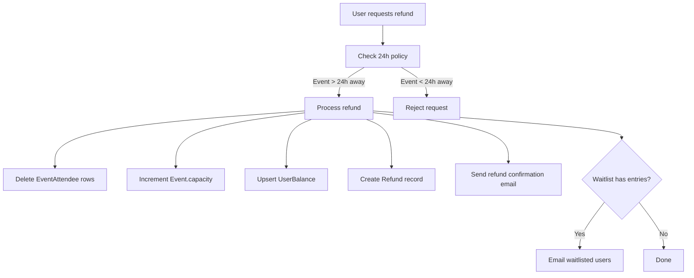

# Meda

Meda is a Next.js event marketplace where admins, pitch owners, facilitators, and attendees can browse events, create and operate events, purchase tickets, scan check-ins, and manage payouts and billing flows.

## Roadmap and Planning Docs

- [Upcoming Features And Services](docs/UPCOMING_FEATURES_AND_SERVICES.md) - proposed next-stage product roadmap and the service-layer boundaries each feature should introduce

## Feature List

### Core Features

- **Browse events** – Search, filter by category, date range, and location; sort by date or price
- **Register / purchase tickets** – Free and paid (Chapa or Meda balance) registration
- **Refund & cancellation** – Cancel tickets up to 24h before event; refunds credited to Meda balance
- **Meda Balance** – Platform credit wallet funded by refunds, usable for future ticket purchases
- **Save events** – Bookmark events from the list or event detail page
- **My Tickets** – Dedicated page for events where the user has tickets
- **Ticket sharing** – Share extra tickets via claim links
- **QR codes for tickets** – Per-ticket QR codes for check-in at events

### Marketplace and Billing

- **Pitch owner onboarding** – Admins can promote existing users to pitch owners from the admin users table
- **Pitch owner events** – Pitch owners can create and manage their own events from profile and create-event flows
- **Payout setup with Chapa** – Pitch owners configure bank details, which are encrypted at rest and used to create a Chapa subaccount
- **Split ticket settlement** – Pitch owner ticket sales use Chapa split payments when paid by Chapa, and a 95% balance credit when paid with Meda balance
- **Event creation fees** – Pitch owner event creation can require a configurable fee before the event is persisted
- **Promo codes** – Admin-managed promo codes can waive or discount pitch owner event creation fees
- **Admin billing controls** – Admins can manage the active event creation fee and promo codes from the profile billing tab
- **Facilitator management** – Pitch owners can add and disable facilitators by email from their profile
- **Facilitator-scoped scanning** – Facilitators can only scan tickets for events owned by their parent pitch owner

### Admin Features

- **User management** – Manage users, promote users to pitch owners, and update admin access
- **Billing management** – Configure event creation fees and promo codes
- **QR code scanning** – Admin link on event page (`/events/[id]/scan`) to scan attendee QR codes
- **Scan tracking** – When a ticket was scanned before, admins see attendee name and previous scan details (time, scanner)
- **Event scoping** – Admins scanning on event A’s page get an error if the ticket is for event B

### Discovery and Filtering

- **Category filter** – Filter events by category
- **Date range filter** – Presets: this week, this weekend, this month (with correct Sunday handling)
- **Geolocation** – “Use my location” to center map and find nearby events
- **Host/organizer profile** – Public host page at `/hosts/[id]` with their events

### Engagement

- **Event reminder emails** – 24h and 1h before event start (cron)
- **Add to calendar** – ICS export and “Add to calendar” in confirmation emails
- **Waitlist** – Join waitlist for sold-out events; automatic promotion when capacity increases; notified when spots open from refunds

### Technical

- **Per-event SEO** – Unique metadata and Open Graph per event
- **Saved events in Prisma** – `SavedEvent` model with proper ordering
- **Token security** – `TICKET_VERIFICATION_SECRET` required in production

---

## Marketplace and Payout Model

### Roles

- **Admin** – Full platform oversight: users, events, billing, scanning, and pitch owner promotion
- **Pitch owner** – Creates and manages own events, configures payout details, and manages facilitators
- **Facilitator** – Scans tickets only for the pitch owner who added them
- **User** – Browses events, buys tickets, saves events, and manages owned tickets

Neon Auth still stores base auth roles (`admin`, `user`). Marketplace roles (`pitch_owner`, `facilitator`) are derived from the database and injected into the server session at runtime.

### Event Ownership

- **Admin-created events** – Ticket revenue stays on the platform account
- **Pitch-owner-created events** – Ticket revenue is split between the platform and the pitch owner
- **Create event access** – Only admins and pitch owners can access the create-event flow

### Pitch Owner Payout Flow

1. Admin promotes an existing user to pitch owner.
2. A `PitchOwnerProfile` record is created for that user.
3. The pitch owner opens the payout settings tab in `/profile`.
4. The pitch owner submits bank details and business name.
5. Bank details are encrypted at rest using `PAYOUT_ENCRYPTION_KEY`.
6. Meda creates a Chapa subaccount and stores `chapaSubaccountId` plus `payoutSetupVerifiedAt`.
7. Until payout is verified, pitch owners cannot create events and their events cannot accept paid checkout.

Implementation notes:

- Manual subaccount linking is removed; subaccounts are created only through the Chapa API.
- Chapa subaccount ID parsing accepts multiple response shapes, including `data.subaccount_id`, `data["subaccounts[id]"]`, `data.id`, nested `subaccounts.id`, and raw string responses.
- When a subaccount already exists, the payout UI shows the verified subaccount details and lets the user explicitly switch into update mode.

### Ticket Settlement Model

- **Chapa checkout for pitch owner events** – Meda initializes checkout with `subaccounts` so Chapa can split the transaction
- **Current default split** – 5% platform commission, 95% to the pitch owner
- **Balance payments for pitch owner events** – The platform debits the buyer’s Meda balance and credits 95% of the order total to the pitch owner’s `UserBalance`
- **Admin events** – No split; revenue stays on the platform account

Important note:

- Refunds for balance-paid pitch owner tickets do not yet reverse the pitch owner share automatically.

### Event Creation Fee Flow

Pitch owner event creation now supports a fee-first flow:

1. Pitch owner fills the create-event form.
2. Meda validates the payload and stores a pending event creation payment record with the serialized event payload.
3. If a fee is due, Meda initializes a Chapa checkout and redirects the user.
4. On successful payment confirmation, Meda creates the event from the stored payload.
5. If a promo code waives the full fee, Meda creates the event immediately and records the fee as `waived`.

Admin billing controls now manage:

- the current event creation fee
- promo codes
- promo code scope: global or pitch-owner-specific
- promo code status, expiry, and usage caps

### Facilitators and Scanning

- Pitch owners can add facilitators from the profile by email
- Facilitators are linked through the `Facilitator` table to one parent pitch owner
- Scan authorization is enforced server-side:
  - admin can scan any event
  - pitch owner can scan own events
  - facilitator can scan only events whose `event.userId` matches their parent pitch owner

### New Marketplace Models

The Prisma schema now includes:

- `PitchOwnerProfile`
- `Facilitator`
- `PromoCode`
- `EventCreationFeeConfig`
- `EventCreationPayment`
- `Payment.chapaSubaccountId`

## Latest Marketplace Changes

### Newly Implemented

| Area | Description |
| --- | --- |
| Role enrichment | `pitch_owner` and `facilitator` are derived from DB state and added to the session |
| Pitch owner promotion | Admins can promote a user to pitch owner from the admin users table |
| Payout setup | Pitch owners can verify payout details and create a Chapa subaccount from profile |
| Event creation billing | Pitch owner event creation now supports fee-based checkout before event persistence |
| Promo codes | Admins can create and manage promo codes for event creation fees |
| Split settlement | Pitch owner ticket sales now split correctly for both Chapa and Meda balance purchases |
| Facilitators | Pitch owners can add or disable facilitators by email |
| Scan scope | Admin, pitch owner, and facilitator scan permissions are enforced on the server |

### Chapa Notes

- Chapa split-payment debug logging is enabled in non-production when ticket checkout is initialized.
- The log includes whether `subaccounts` were attached and the split payload sent to Chapa.
- Chapa subaccount creation is expected to use valid Chapa credentials; if you test payout setup locally, use the appropriate environment for your key type.

## Changes from Previous Version

### New Features

| Feature            | Description                                                                        |
| ------------------ | ---------------------------------------------------------------------------------- |
| Admin QR scanner   | Link for admins on event page to scan tickets at `/events/[id]/scan`               |
| Scan tracking      | `ticket_scan` table records scans; admins see “Already scanned” with attendee info |
| Event scoping      | Verify API rejects tickets for a different event when admin scans                  |
| Waitlist promotion | When admin increases capacity, waitlisted users are promoted and emailed           |
| Category labels    | EventCard shows real `categoryName` from API                                       |
| Weekend filter fix | Sunday shows “this weekend” (yesterday–today) instead of next weekend              |
| Saved events order | API preserves `createdAt` order of saved events                                    |

### Improvements

| Area            | Change                                                            |
| --------------- | ----------------------------------------------------------------- |
| Layout metadata | Open Graph description aligned with main metadata                 |
| Token secret    | Throws in production if `TICKET_VERIFICATION_SECRET` is missing   |
| Reminder cron   | Whitelisted schema/table; parameterized `userIds` query           |
| TicketQRPanel   | Uses `attendeeIds.length` as source of truth; handles empty state |
| QRScanner       | Passes `eventId` to verify API; stable keys for recent scans list |

### New Files

- `services/waitlistPromotion.ts` – Promotes waitlisted users when capacity increases
- `prisma/migrations/20260304000000_reminder_log/migration.sql` – Reminder deduplication
- `prisma/migrations/20260304000100_event_waitlist/migration.sql` – Waitlist model
- `prisma/migrations/20260305000000_ticket_scan/migration.sql` – Scan history

---

This document provides:

- local setup and migration workflow
- detailed ticket sharing architecture and behavior
- `My Events` feature overview
- key components, APIs, and data model references

## Recent Improvements

The following improvements were made as part of a comprehensive audit:

### Database & Performance

- **Database indexes** — Added `@@index` to `Event`, `EventAttendee`, `Payment`, and `Refund` models for faster queries
- **Geo-filtering optimization** — Bounding-box pre-filter reduces in-memory haversine calculations in the events list endpoint
- **Cron email batching** — Reminder emails are sent in concurrent batches of 10 using `Promise.allSettled` instead of sequentially

### Security

- **Upstash Redis rate limiting** — Rate limiter supports Upstash Redis for distributed deployments with in-memory fallback
- **Error sanitization** — API 500 responses no longer leak internal error messages; details are logged server-side only
- **Zod validation** — Standardized Zod schemas for event registration, refund, and payment request bodies

### Frontend Robustness

- **Effect cleanup** — All async `useEffect` hooks now include `cancelled` flags to prevent state updates on unmounted components
- **CSS bug fixes** — Fixed invalid Tailwind CSS variable syntax (`text-(--var)` → `text-[var(--var)]`) in host profile and ticket verify pages
- **ARIA tabs** — Tab bars in `ProfileDashboard` and `MyEventsPanel` now include proper `role="tablist"`, `role="tab"`, `role="tabpanel"`, and `aria-selected` attributes
- **Route-level error boundaries** — Added `error.tsx` for `/events`, `/profile`, and `/create-events` routes
- **Shared constants** — Extracted magic numbers (`MAX_TICKETS_PER_USER_PER_EVENT`, `REFUND_CUTOFF_HOURS`, `DEFAULT_MAP_CENTER`) to `lib/constants.ts`

### Code Quality

- **Structured logging** — Replaced all `console.error`/`console.warn` calls with a structured `logger` wrapper (`lib/logger.ts`)
- **Shared API error helper** — `apiError()` and `formatUnknownError()` in `lib/apiResponse.ts` for consistent error responses
- **Deduplicated utilities** — Extracted shared `getErrorMessage` (`lib/errorMessage.ts`), `getAuthUserEmails` (`lib/auth/userLookup.ts`), and test helpers (`__tests__/helpers/test-utils.ts`)
- **Prettier** — Added `.prettierrc` config and integrated with ESLint via `eslint-config-prettier`

### SEO & Infrastructure

- **robots.txt** — Machine-readable robots configuration via `app/robots.ts`
- **Dynamic sitemap** — Auto-generated sitemap with static pages and upcoming events via `app/sitemap.ts`
- **Canonical URLs** — Added `metadataBase` and `alternates.canonical` to root layout metadata
- **CI pipeline** — GitHub Actions workflow (`.github/workflows/ci.yml`) runs lint, type-check, unit tests, integration tests, and E2E coverage on PRs

### Testing

- **New test suites** — Added tests for event creation, ticket sharing service, and refund validation
- **Test helper extraction** — Shared `makeSessionUser`, `makeEvent`, `makeRequest`, `futureDate` in `__tests__/helpers/test-utils.ts`
- **Rate limit mocks** — Fixed missing rate limit mock in registration tests and updated all mocks for async rate limiter

## Tech Stack

- Next.js App Router (`app/`)
- React client components for interactive UI
- Prisma + PostgreSQL (Neon)
- Neon Auth for authentication/session
- Chapa for paid checkout flow
- Upstash Redis (optional, for distributed rate limiting)

## Local Setup

1. Install dependencies:
   ```bash
   npm install
   ```
2. Configure environment variables in `.env`.
3. Run Prisma migrations:
   ```bash
   npx prisma migrate deploy
   npx prisma generate
   ```
4. Start development server:
   ```bash
   npm run dev
   ```
5. Open `http://localhost:3000`.

## Environment Variables

The marketplace and payout flows additionally rely on:

- `CHAPA_SECRET_KEY` – Required for ticket checkout, event creation fee checkout, bank lookup, and subaccount creation
- `CHAPA_WEBHOOK_SECRET` – Required in production to verify Chapa webhook signatures
- `CHAPA_CALLBACK_URL` – Optional override for Chapa callback handling
- `PAYOUT_ENCRYPTION_KEY` – Required 32-byte secret for AES-256-GCM encryption of pitch owner bank details
- `SUPABASE_URL`
- `SUPABASE_SERVICE_ROLE_KEY`
- `SUPABASE_BUCKET_EVENTS`

If `.next/types` becomes stale after route refactors, clear `.next` and rerun type-checking before assuming there is a source-level TypeScript issue.

## Test Commands

- Unit and API tests:
  ```bash
  npm test
  ```
- Ephemeral Postgres integration and concurrency tests (requires Docker):
  ```bash
  npm run test:integration
  npm run test:concurrency
  ```
- Playwright end-to-end coverage:
  ```bash
  npx playwright install chromium
  npm run test:e2e
  ```

## Migration Notes (Neon Branches and Data Safety)

If your database has schema drift and `prisma migrate dev` suggests reset:

- Do not run reset on data you want to keep.
- Prefer Neon branch-based workflow:
  - create a branch in Neon
  - point `DATABASE_URL` to that branch
  - use `prisma migrate resolve --applied <migration_name>` for baseline/manual tables
  - use `npx prisma migrate deploy` to apply pending migrations

This project includes a baseline migration for `saved_events` to avoid destructive reset when drift exists.

## Feature Overview

### Ticket Sharing

Ticket owners can share extra tickets from the same event using a claim link.

#### Business Rules

- User must own at least 2 tickets to generate a share link.
- Shareable quantity is always `ownedTickets - 1` (owner keeps at least one ticket).
- Claim link requires sign-in.
- Link expires at event start.
- Owner cannot claim their own link.
- Same claimant cannot claim twice from the same invitation.
- Claiming transfers one ticket from owner to claimant.
- A claimant who already has a ticket for that event can still claim another (multi-ticket ownership is allowed).

### My Tickets

A dedicated page for events where the user has at least one ticket:

- routes: `/my-tickets` (primary) and `/my-events` (compat redirect)
- included in header nav
- supports `upcoming`, `past`, and `all` filters
- shows event metadata and ticket counts
- allows generating share links for events with more than one ticket

## Ticket Sharing: Components, APIs, and Flow

### Data Model

Defined in `prisma/schema.prisma`:

- `EventAttendee`
  - one row per ticket
  - ownership is represented by `userId`
- `Invitation`
  - stores share-link state and constraints:
    - `tokenHash`
    - `status` (`Active`, `Expired`, `Revoked`)
    - `expiresAt`
    - `maxClaims`
    - `claimedCount`
- `InvitationClaim`
  - records who claimed from a link
  - unique `(invitationId, claimedByUserId)` prevents duplicate claim per invitation
- `SavedEvent` – user bookmarks; unique `(eventId, userId)`
- `EventWaitlist` – sold-out waitlist; unique `(eventId, userId)`
- `ticket_scan` (raw table) – scan history: `attendee_id`, `event_id`, `scanned_by_user_id`, `scanned_at`

Migration files:

- `prisma/migrations/20260226000000_saved_events_baseline/migration.sql`
- `prisma/migrations/20260226000100_ticket_sharing_claims/migration.sql`
- `prisma/migrations/20260304000000_reminder_log/migration.sql` – reminder deduplication
- `prisma/migrations/20260304000100_event_waitlist/migration.sql` – waitlist
- `prisma/migrations/20260305000000_ticket_scan/migration.sql` – scan history

### Token Security

Implemented in `lib/tickets/shareTokens.ts`:

- generate cryptographically random token
- store only SHA-256 hash in DB
- raw token appears only in share URL returned to owner

### Service Layer

Implemented in `services/ticketSharing.ts`:

- `createShareLink(...)`
  - validates event and owner ticket count
  - rotates token on re-generation
  - updates/reuses invitation record and preserves claim history
  - returns share URL and remaining slots

- `getShareLinkDetails(token)`
  - resolves invitation by token hash
  - computes and returns link status + event metadata
  - auto-marks active link as expired if time has passed

- `claimShareLink(...)`
  - enforces auth/business rules
  - validates active/remaining claim slot
  - checks duplicate claim by same user
  - transfers one `EventAttendee` row from owner to claimant in a transaction
  - increments claim counter atomically

- `revokeShareLink(...)`
  - owner-only
  - marks link as revoked

### API Endpoints

Implemented under `app/api/tickets/share/...`:

- `POST /api/tickets/share/create`
  - body: `{ eventId }`
  - response includes `shareUrl`, `remainingClaims`, and metadata

- `GET /api/tickets/share/[token]`
  - returns share-link details for claim page

- `POST /api/tickets/share/[token]/claim`
  - transfers one ticket to signed-in claimant
  - revalidates event/profile pages after success

- `POST /api/tickets/share/[token]/revoke`
  - owner revokes active link

## UI Surfaces and User Experience

### 1) Event Details (`/events/[id]`)

Component: `app/components/RegisterPanel.tsx`

Capabilities:

- displays current user ticket count for selected event
- if `myTickets > 1`, shows share panel
- allows:
  - generate link
  - regenerate link
  - copy link
  - inline `Copied` indicator + toast feedback

Additional behavior:

- after successful free registration or paid confirmation, if user crosses above 1 ticket, share panel can be used immediately.

### 2) My Events (`/my-events`)

Files:

- `app/my-events/page.tsx`
- `app/components/profile/MyEventsPanel.tsx`

Capabilities:

- list ticketed events for logged-in user
- filter by status (upcoming/past/all)
- per event:
  - view event
  - show `Share link` action when `ticketCount > 1`
  - copy feedback via inline `Copied` indicator and toast

### 3) Profile > Registered Events (`/profile`)

Component: `app/components/profile/ProfileDashboard.tsx`

Capabilities:

- in Registered Events tab, each event row shows:
  - `View`
  - `Save/Unsave`
  - `Share link` (when `ticketCount > 1`)
- copy feedback via inline `Copied` indicator and toast

### 4) Claim Page (`/tickets/claim/[token]`)

Files:

- `app/tickets/claim/[token]/page.tsx`
- `app/components/tickets/TicketClaimPanel.tsx`

Capabilities:

- requires authentication (redirects to sign-in with callback)
- loads invitation + event details
- displays link status and remaining claims
- allows claimant to claim ticket when eligible

## End-to-End Flow Details

### Generate Share Link Flow

1. User clicks share action from event/profile/my-events.
2. Client calls `POST /api/tickets/share/create`.
3. Backend validates ownership/ticket count/event time.
4. Backend creates or updates invitation and rotates token.
5. UI receives `shareUrl`, then:
   - shows link in panel (event page), or
   - copies link directly (my-events/profile)
6. User sees toast and inline copied indicator.

### Claim Flow

1. Friend opens `/tickets/claim/[token]`.
2. If not signed in, redirected to sign-in and back.
3. Claim page fetches invitation details.
4. User clicks claim.
5. Backend transaction:
   - validates status/rules
   - reserves claim slot
   - transfers ticket ownership (`EventAttendee.userId`)
   - records `InvitationClaim`
6. User is redirected to event page on success.

### Regenerate Link Flow

1. Owner generates link again.
2. Backend rotates token hash on invitation.
3. Previous raw link is no longer valid.
4. Claim history stays attached to invitation record.

## Implementation Details

### QR Codes and Verification

- **Token format** – HMAC-signed `attendeeId` in `lib/tickets/verificationToken.ts`
- **QR generation** – `GET /api/tickets/[attendeeId]/qr` returns PNG; user must own the ticket
- **Verification** – `GET /api/tickets/verify/[token]` validates token, returns event/attendee info
- **Admin scan** – When session has `role === "admin"`, API records scan in `ticket_scan` and returns `alreadyScanned` + `previousScan` if previously scanned
- **Event scoping** – Optional `?eventId=` query param; if ticket is for a different event, returns 400

### Waitlist

- **Model** – `EventWaitlist` with `(eventId, userId)` unique
- **Join** – `POST /api/events/[id]/waitlist` when event is sold out
- **Leave** – `DELETE /api/events/[id]/waitlist`
- **Promotion** – Triggered in admin PATCH when `capacity` is updated and `> 0`; `promoteWaitlistForEvent()` creates attendees, decrements capacity, sends confirmation emails

### Refund & Cancellation

Users can cancel tickets and receive a refund credited to their Meda balance (platform credit), which can be used for future ticket purchases.

#### Refund Flow



#### Refund Policy

- Refunds are available up to **24 hours** before the event start time
- No refunds within 24 hours of the event start
- Refund amount is credited to the user's **Meda balance** (not back through Chapa)
- Free event tickets can be cancelled with the same 24h policy (no monetary refund)
- Refund policy is displayed during ticket purchase and in confirmation emails

#### Meda Balance

- Platform credit stored in the `UserBalance` table
- Funded exclusively by refunds
- Can be used as a payment method during checkout (instead of or alongside Chapa)
- Balance is displayed on the user's profile page
- During checkout, users with a balance can choose between paying with Meda Balance or Chapa

#### Data Model

- **`UserBalance`** – One row per user; stores `balanceEtb` (Decimal)
- **`Refund`** – One row per refund transaction; stores `eventId`, `userId`, `amountEtb`, `ticketCount`

#### API Endpoints

- `POST /api/events/[id]/refund` – Request a refund (body: `{ ticketCount?: number }`)
- `GET /api/profile/balance` – Get user's current balance
- `POST /api/payments/balance` – Pay for tickets using Meda balance (body: `{ eventId, quantity }`)
- `DELETE /api/events/[id]` – Cancel all tickets for an event (alternative to refund endpoint)

#### Waitlist Notification

When a refund opens capacity, the next users on the waitlist (FIFO by join date) receive an email notification that a spot is available. They can then visit the event page and register/purchase.

### Reminder Emails

- **Cron** – `GET /api/cron/send-reminders` (Vercel Cron, hourly); requires `Authorization: Bearer ${CRON_SECRET}`
- **Windows** – 24h and 1h before event start
- **Deduplication** – `reminder_log` table with `(event_id, user_id, reminder_type)` unique

### Environment Variables

| Variable                          | Purpose                                                |
| --------------------------------- | ------------------------------------------------------ |
| `CRON_SECRET`                     | Auth for reminder cron                                 |
| `TICKET_VERIFICATION_SECRET`      | HMAC secret for ticket tokens (required in production) |
| `AUTH_SCHEMA` / `AUTH_USER_TABLE` | Override auth table for reminders/waitlist emails      |

---

## Key File Map

- Header/Nav
  - `app/components/HeaderNav.tsx`
- Event registration/purchase UI
  - `app/components/RegisterPanel.tsx`
- My Events page
  - `app/my-events/page.tsx`
  - `app/components/profile/MyEventsPanel.tsx`
- Profile dashboard
  - `app/components/profile/ProfileDashboard.tsx`
- Claim page
  - `app/tickets/claim/[token]/page.tsx`
  - `app/components/tickets/TicketClaimPanel.tsx`
- Sharing backend
  - `app/api/tickets/share/create/route.ts`
  - `app/api/tickets/share/[token]/route.ts`
  - `app/api/tickets/share/[token]/claim/route.ts`
  - `app/api/tickets/share/[token]/revoke/route.ts`
  - `services/ticketSharing.ts`
  - `lib/tickets/shareTokens.ts`
- Ticket ownership/event APIs
  - `app/api/events/[id]/route.ts`
  - `app/api/profile/registered-events/route.ts`
- QR codes and scanning
  - `app/api/tickets/[attendeeId]/qr/route.ts`
  - `app/api/tickets/verify/[token]/route.ts`
  - `app/components/tickets/TicketQRPanel.tsx`
  - `app/components/tickets/QRScanner.tsx`
  - `app/events/[id]/scan/page.tsx`
  - `lib/tickets/verificationToken.ts`
- Waitlist
  - `app/api/events/[id]/waitlist/route.ts`
  - `services/waitlistPromotion.ts`
- Refunds & Balance
  - `app/api/events/[id]/refund/route.ts`
  - `app/api/profile/balance/route.ts`
  - `app/api/payments/balance/route.ts`
  - `services/refunds.ts`
- Reminders
  - `app/api/cron/send-reminders/route.ts`

## QA Checklist

- Generate link with exactly 2 tickets.
- Generate link with 5 tickets and confirm up to 4 claims available.
- Regenerate link and verify old link no longer works.
- Claim while already owning ticket for same event.
- Confirm owner cannot claim own link.
- Confirm same user cannot claim twice from same invitation.
- Confirm expired/revoked links fail with clear message.
- Verify share controls appear in:
  - event details
  - my events
  - profile registered events
- Refund: cancel ticket for event > 24h away and verify balance is credited.
- Refund: attempt cancel for event < 24h away and verify rejection.
- Refund: cancel ticket for sold-out event and verify waitlisted user gets notification email.
- Balance payment: purchase ticket using Meda balance and verify balance is deducted.
- Balance payment: attempt purchase with insufficient balance and verify error.
- Verify refund policy text appears in RegisterPanel and confirmation emails.
- Verify Meda balance is shown on profile page when > 0.
